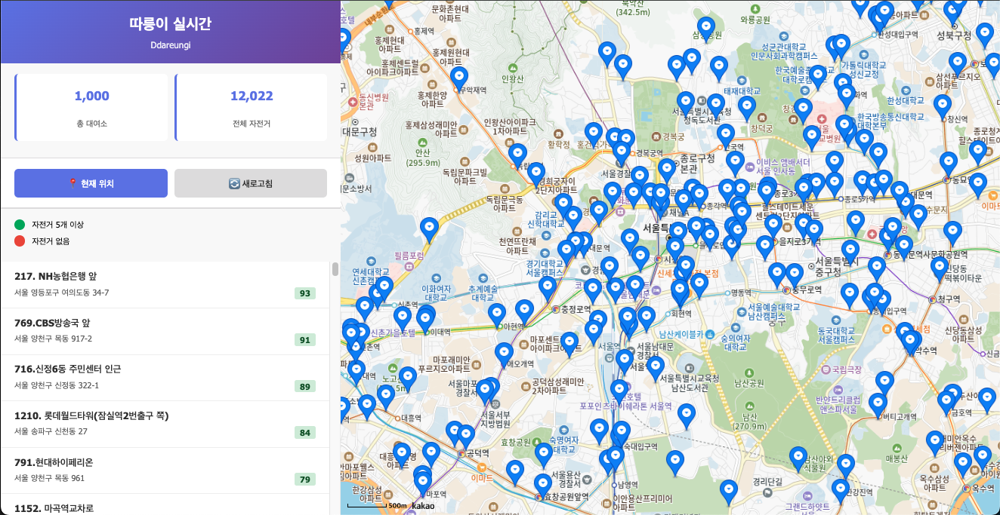

# 🚲 서울시 공공자전거 실시간 대여정보 (Ddareungi Live Status)

서울시 공공자전거 **따릉이**의 실시간 대여소 현황을 **지도 기반**으로 제공하는 웹 애플리케이션이다. 사용자에게 최신 대여 가능 정보를 직관적인 UX로 제공한다.



-----

## 📌 프로젝트 개요 (Overview)

**서울시 열린데이터 광장의 공공자전거 API**를 활용하여 대여소 상태를 조회하고 **Kakao Map** 상에 시각화하는 서비스이다. 효율적인 데이터 표시와 사용자 위치 기반 서비스를 통해 따릉이 이용 편의성을 극대화한다.

### 핵심 기술 및 특징

  * **실시간 데이터 연동:** 서울시 공공 데이터 API를 활용한 실시간 정보 처리.
  * **시각화:** Kakao Map SDK 및 **Marker Clustering**을 통한 최적화된 지도 디스플레이.
  * **현대적 아키텍처:** **Vite** 기반의 빠른 개발 환경 및 **ES Modules**를 통한 모듈화 구조 사용.

-----

## ⭐ 주요 기능 상세 (Features)

### 1\. 데이터 및 상태 관리

  * **실시간 동기화:** 모든 대여소의 현재 대여 가능 자전거 수 및 거치대 수 실시간 조회.
  * **통계 표시:** 전체 대여소 수 및 총 보유 자전거 수 집계 및 UI 반영.

### 2\. 지도 시각화 및 UX

  * **Marker Clustering:** 다수의 대여소 마커를 효율적으로 그룹화하여 지도의 성능 및 시각적 가독성 확보.
  * **Geolocation Service:** `navigator.geolocation` API를 활용하여 사용자의 현재 위치를 기반으로 지도 이동 및 줌 레벨 조정.
  * **목록 연동:** 목록 항목 클릭 시 해당 대여소 위치로 지도 포커스 이동.

### 3\. 개발 환경 (Development Environment)

  * **Vite Integration:** HMR(Hot Module Replacement) 지원을 통한 신속한 개발 주기(Development Cycle) 확보.
  * **ES Modules (ESM):** `*.mjs`를 활용하여 모듈 간 의존성을 명확히 분리하고 코드 재사용성을 높인 구조.

-----

## 🛠️ 기술 스택 (Tech Stack)

| 분야 | 기술 | 설명 |
| :--- | :--- | :--- |
| **Client-Side** | HTML5, CSS3, JavaScript (ES Modules) | 표준 웹 기술 기반의 프론트엔드 구현 |
| **Development** | **Vite** | 프론트엔드 빌드 툴, 개발 서버 및 번들링 담당 |
| **API Source** | 서울시 공공자전거 API | 실시간 대여소 현황 데이터 연동 |
| **Mapping Service** | Kakao Map SDK | 지도 엔진, Clusterer 및 Geolocation/Services 라이브러리 활용 |

-----

## 🚀 사용법

### 1️⃣ 프로젝트 클론

```bash
git clone https://github.com/LeF-0213/Ddareungi.git
cd Ddareungi
```

### 2️⃣ 의존성 설치

```bash
npm install
```

### 3️⃣ 환경 변수 설정 (Configuration)

프로젝트 **루트 경로**에 `.env` 파일을 생성하고, 발급받은 API 키를 다음 형식으로 설정합니다.

> ⚠️ **Vite 규약:** 클라이언트 코드(`import.meta.env`)에서 접근하는 변수는 **`VITE_`** 접두사를 사용해야 한다.

> 브라우저 기반에서는 **Node.js 전용 구문**인 `process.env` 사용 불가

```text
# .env 파일
VITE_SEOUL_API_KEY="[서울시 API 키를 입력하세요]"
VITE_KAKAO_MAP_KEY="[카카오 지도 API 키를 입력하세요]"
```

-----

## ⚙️ Vite 개발 환경 설정

`vite.config.js` 파일은 다음과 같이 설정되어 있습니다.

```javascript
// vite.config.js
import { defineConfig } from "vite";

export default defineConfig({
  server: {
    port: 5500,     // 개발 서버 포트: 5500
    open: true,     // 서버 시작 시 브라우저 자동 실행
    host: '127.0.0.1' // 로컬 환경(localhost)으로만 접근 허용
  }
  // ... (다른 설정)
});
```

### 4️⃣ 개발 서버 실행

```bash
npm run dev
```

*접근 주소:* `http://127.0.0.1:5500`

-----

## 📂 파일 구조 (Project Structure)

```
Ddareungi/
├── src/
│   ├── css/
│   │   └── style.css        # 스타일 정의 (모바일 반응형 통합)
│   └── js/
│       ├── config/config.mjs    # 환경 변수 모듈
│       ├── api.mjs          # API 통신 계층
│       ├── main.mjs         # 애플리케이션 엔트리 포인트
│       ├── map.mjs          # 지도 관련 함수 및 상태 관리
│       ├── ui.mjs           # 사용자 인터페이스 (DOM 조작)
│       └── utils.mjs        # 유틸리티 함수 (선택적)
├── index.html             # 메인 HTML 템플릿 (SDK 정적 로드)
├── package.json
├── vite.config.js         # Vite 설정 파일
└── .env                   # 환경 변수 파일
```

-----